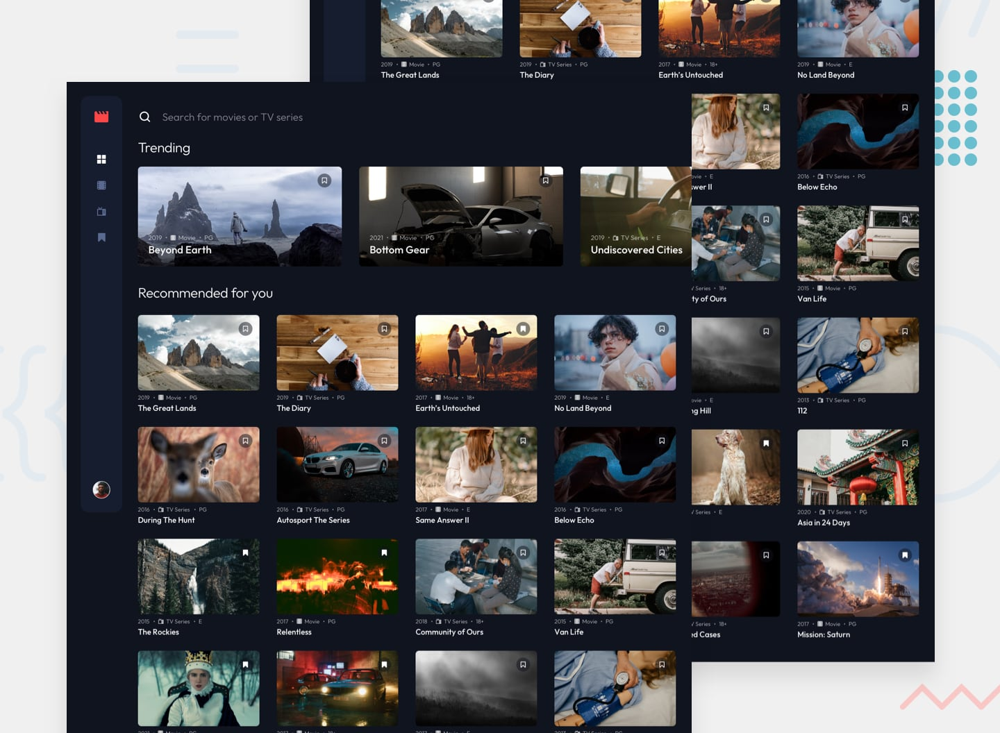

# Entertainment web app



## Overview
This is a **frontend web application** for browsing, searching, and bookmarking movies. Built with Next.js and powered by the OMDb API for real-time movie search and detailed movie information.

Users can browse a curated collection of movies, search for any movie via the OMDb API, view detailed movie information in a modal overlay, and save their favorites to a persistent bookmarks list using `localStorage`.

---
## What the App Does
- **Browse Movies** — View a curated catalog of movies organized into "Trending" and "Recommended" sections.
- **Filter by Category** — Filter movies by category (e.g., Movie, TV Series) via the navigation bar, with filter state reflected in URL query parameters.
- **Search Movies** — Search for any movie by title. The app queries the OMDb API in real time and displays normalized results.
- **View Movie Details** — Click on a search result to fetch and display detailed movie information (plot, cast, ratings, etc.) in a modal overlay.
- **Bookmark Movies** — Toggle bookmarks on any movie card. Bookmarks persist across sessions via `localStorage`.
- **Dedicated Bookmarks Page** — View all saved bookmarks in one place at `/bookmarks`.
- **Responsive Design** — Fully responsive layout with mobile and desktop navigation variants.
---
## Tech Stack
| Layer        | Technology                          |
|-------------|--------------------------------------|
| Framework   | [Next.js 16+](https://nextjs.org/) (App Router) |
| Language    | TypeScript                           |
| Styling     | Tailwind CSS                         |
| State       | React `useState` / `useEffect`       |
| Persistence | `localStorage` (via custom hook)     |
| External API| [OMDb API](http://www.omdbapi.com/)  |
| Routing     | Next.js App Router + `useSearchParams` |
| Deployment  | Vercel (recommended)                 |
---
## Project Structure
```
├── app/
│   ├── page.tsx                        # Home page (Trending, Recommended, Search)
│   ├── bookmarks/
│   │   └── page.tsx                    # Bookmarks page
│   ├── _components/
│   │   ├── Navbar.tsx                  # Navigation (mobile + desktop variants)
│   │   ├── SearchBar.tsx               # Search input component
│   │   ├── Trending.tsx                # Trending movies section
│   │   ├── Recommended.tsx             # Recommended movies section
│   │   ├── SearchResults.tsx           # Search results grid
│   │   ├── MovieCard.tsx               # Individual movie card
│   │   └── ModalOverlay.tsx            # Movie details modal
│   └── api/
│       └── movies/
│           ├── route.ts                # GET /api/movies?title=<query> (search proxy)
│           └── movie-details/
│               └── route.ts            # GET /api/movies/movie-details?movie-id=<id> (details proxy)
├── hooks/
│   └── useBookmarks.ts                # Custom hook for bookmark state + localStorage sync
├── lib/
│   ├── getMovies.ts                   # Client-side fetch helper for movie search
│   └── getMovieDetails.ts            # Client-side fetch helper for movie details
├── data1.json                         # Curated local movie dataset
├── .env.local                         # Environment variables (API key)
└── README.md
```
---
## Features Implemented
- [x] Curated movie catalog from local JSON data
- [x] Trending and Recommended sections on the home page
- [x] Category-based filtering with URL query parameter persistence
- [x] Real-time movie search via OMDb API
- [x] API route proxy to keep the OMDb API key server-side
- [x] Movie detail modal with extended information (fetched by IMDb ID)
- [x] Bookmark toggling on any movie card
- [x] Persistent bookmarks via `localStorage` (custom `useBookmarks` hook)
- [x] Dedicated `/bookmarks` page
- [x] Responsive design with separate mobile and desktop navigation
- [x] Normalized data model between local JSON and OMDb API responses
---
## Development Setup
### Prerequisites
- **Node.js** ≥ 18.x
- **npm**, **yarn**, or **pnpm**
- An **OMDb API key** — get one free at [omdbapi.com/apikey.aspx](http://www.omdbapi.com/apikey.aspx)
### 1. Clone the Repository
```bash
git clone https://github.com/UloakuObi/entertainment-app.git
cd entertainment-app
```
### 2. Install Dependencies
```bash
npm install
# or
yarn install
# or
pnpm install
```
### 3. Configure Environment Variables
Create a `.env.local` file in the project root:
```env
OMDB_API_KEY=your_omdb_api_key_here
```
> **Do not commit this file.** It is (and should be) listed in `.gitignore`.
### 4. Verify Local Data
Ensure `data1.json` exists in the project root with the following structure:
```json
{
  "movies": [
    {
      "id": "unique-id",
      "title": "Movie Title",
      "thumbnail": {
        "trending": { "small": "url", "large": "url" },
        "regular": { "small": "url", "medium": "url", "large": "url" }
      },
      "year": 2024,
      "category": "Movie",
      "rating": "PG",
      "isBookmarked": false,
      "isTrending": true
    }
  ]
}
```
---
## How to Run
### Development
```bash
npm run dev
```
Open [http://localhost:3000](http://localhost:3000) in your browser.
### Production Build
```bash
npm run build
npm run start
```
### Linting
```bash
npm run lint
```
---
## Deployment
This app is optimized for deployment on **[Vercel](https://vercel.com/)**:
1. Push your repository to GitHub/GitLab/Bitbucket.
2. Import the project into Vercel.
3. Add the `OMDB_API_KEY` environment variable in Vercel's project settings under **Settings → Environment Variables**.
4. Deploy — Vercel will automatically detect the Next.js framework and configure the build.
For other platforms (Netlify, Railway, Docker, etc.), ensure:
- The `OMDB_API_KEY` environment variable is set in the hosting environment.
- The platform supports Next.js API routes (serverless functions or a Node.js server).
---
## Notes
- **Bookmarks are stored client-side** in `localStorage`. They do not sync across devices or browsers. A future enhancement could integrate a database-backed user authentication system.
- **The OMDb API free tier** is limited to 1,000 requests per day. Monitor usage if deploying publicly.
- **Type definitions** (`moviesData`, `MovieDetails`, `OmdbMovieData`) should be defined in a shared `types/` directory for better maintainability.
